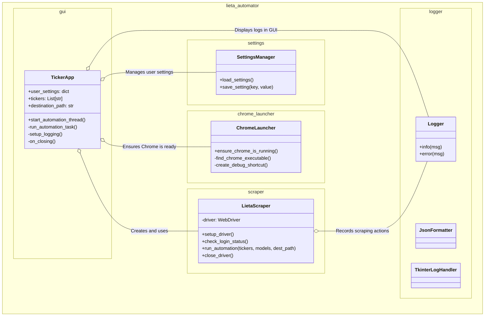
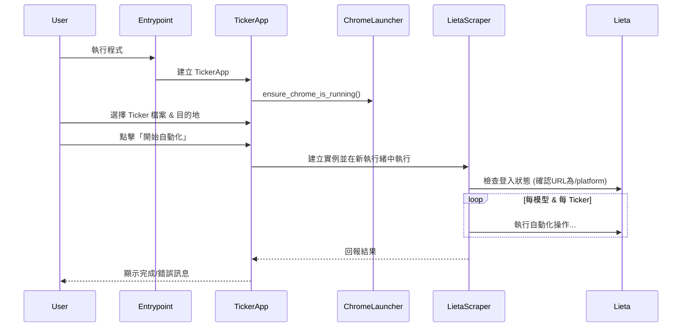

# Lieta Research 自動化工具架構說明
> **目的**
> 透過 GUI 讓非程式人員一次輸入多個 Ticker，批次呼叫 Lieta Research Web 平台下載各種量化模型（Gamma／Term／Smile／TV Code）結果，並依模型與時間戳自動整理檔案後搬移至指定資料夾。

## 1. 專案結構 (模組化)

應用程式已重構為一個高度模組化的 Python 套件，以提高可維護性、擴充性和穩定性。

```
/
├── lieta_automator/
│   ├── __init__.py           # 將資料夾標示為 Python 套件
│   ├── main.py               # 應用程式主邏輯進入點
│   ├── gui.py                # 包含 TickerApp 類別，處理使用者介面
│   ├── scraper.py            # 包含 LietaScraper 類別，處理網頁自動化
│   ├── chrome_launcher.py    # 處理啟動與檢查偵錯模式的 Chrome
│   ├── logger.py             # 設定日誌系統 (GUI + 檔案)
│   ├── settings.py           # 處理使用者設定的載入與儲存
│   └── config.py             # 存儲所有應用程式靜態設定值
│
├── .gitignore                # 告訴 Git 忽略哪些檔案
├── requirements.txt          # 列出所有必要的 Python 套件
├── run.py                    # **打包與執行的主要入口點**
├── user_settings.json        # 儲存使用者的偏好設定 (自動生成, 已被 gitignore)
├── log.jsonl                 # 結構化的日誌輸出檔案 (自動生成, 已被 gitignore)
└── 啟動偵錯模式Chrome.lnk    # 快速啟動 Chrome 的捷徑 (已被 gitignore)
```

## 2. 安裝與執行

### 2.1. 安裝依賴套件
在終端機中執行以下指令，安裝所有必要的函式庫：
```bash
pip install -r requirements.txt
```

| 類別 | 套件 | 用途 |
| --- | --- | --- |
| Web 自動化 | `selenium` | 控制 Chrome 瀏覽器、互動、下載檔案。 |
| GUI | `tkinter` | **Python 內建**，無需安裝。用於建立視覺化操作介面。 |
| Windows 捷徑 | `winshell` | 用於建立和管理 Windows 捷徑檔案。 |
| 系統 | `os`, `shutil`, `subprocess` | **Python 內建**。用於檔案與系統操作。 |

### 2.2. 執行程式
使用以下指令從專案根目錄啟動應用程式：
```bash
python run.py
```
程式啟動時會自動檢查 Chrome 是否以偵錯模式執行，並提供指引。

## 3. 安全性考量 (Security)

在將專案發布或分享前，已進行以下安全性審查與強化：

### 3.1. 防止個資外洩 (`.gitignore`)
專案已包含一個全面的 `.gitignore` 檔案，以防止任何敏感或使用者特定的資料被意外上傳到版本控制系統（如 GitHub）。被忽略的關鍵項目包含：
- `automation_profile/`: **(極度敏感)** Chrome 使用者設定檔，包含 Cookies、瀏覽紀錄等。
- `user_settings.json`: 使用者個人的設定，如檔案路徑。
- `log.jsonl`: 包含操作紀錄的日誌檔。
- `*.txt`, `*.lnk`: 使用者自訂的 Ticker 列表和本機捷徑。
- `temp_downloads/`, `__pycache__/`: 暫存與快取檔案。
- `dist/`, `build/`, `*.spec`: PyInstaller 產生的打包檔案。

### 3.2. 程式碼安全
- **無憑證管理**: 程式不儲存或處理使用者帳號密碼，而是依賴使用者已登入的瀏覽器會話。
- **無遠端執行風險**: 未使用 `eval()` 或不安全的反序列化等高風險操作。
- **有限的檔案系統存取**: 檔案操作被嚴格限制在使用者選擇的目錄和專案內的特定檔案。
- **相依性稽核**: 可使用 `pip install pip-audit && pip-audit -r requirements.txt` 指令來掃描相依套件是否存在已知的安全漏洞。

### 3.3. 網路安全
- **遠端偵錯埠**: 程式僅連接到本機 (`127.0.0.1`) 的 Chrome 偵錯埠，不會將其暴露於外部網路。

## 4. 模組與類別設計



| 模組 | 類別/函式 | 關鍵職責 |
| --- | --- | --- |
| `run.py` | (無類別) | - **應用程式主入口點**。<br>- 呼叫 `lieta_automator.main` 來啟動程式。<br>- 解決 PyInstaller 打包時的相對路徑導入問題。 |
| `gui.py` | `TickerApp` | - 建立所有 GUI 元件，處理使用者互動。<br>- 呼叫 `chrome_launcher` 確保瀏覽器就緒。<br>- 從 `settings` 模組載入/儲存使用者偏好。<br>- 在獨立執行緒中啟動 `LietaScraper`，防止介面凍結。<br>- 將日誌顯示在 GUI 上。 |
| `scraper.py` | `LietaScraper` | - 附掛到已在偵錯模式下執行的 Chrome。<br>- **檢查登入狀態**：透過檢查網址是否為 `/platform` 來確認。<br>- **執行 Selenium 操作**：包含切換模型、輸入 Ticker、點擊下載。<br>- **智慧等待**：提交 Ticker 後，會等待最多 60 秒，並每秒檢查一次結果是否載入，以提高穩定性。<br>- 處理檔案下載、重新命名和移動的邏輯。<br>- 將詳細操作過程記錄到 `Logger`。 |
| `chrome_launcher.py` | (函式) | - 自動尋找 Chrome 安裝路徑。<br>- 建立/更新用於啟動偵錯模式的 `.lnk` 捷徑。<br>- 檢查偵錯埠是否被占用，若否，則嘗試啟動 Chrome。 |
| `logger.py` | `logger` | - 設定全域日誌記錄器。<br>- **雙重輸出**：同時將日誌寫入 GUI 的文字方塊和根目錄的 `log.jsonl` 檔案。<br>- 使用 `JsonFormatter` 將檔案日誌格式化為 JSON Lines。 |
| `settings.py` | (函式) | - 從 `user_settings.json` 載入使用者設定（如上次選擇的路徑）。<br>- 將新的使用者設定儲存回 JSON 檔案。 |
| `config.py` | (無類別) | - **動態路徑管理**：偵測執行環境 (PyInstaller 或 .py)，並提供正確的絕對基礎路徑 `BASE_DIR`。<br>- 集中管理所有**靜態**設定，如 URL、埠號、逾時秒數等。 |
| `main.py` | `main()` | - 包含應用程式的主要啟動邏輯，由 `run.py` 呼叫。 |

## 5. 日誌記錄 (Logging)
新版程式導入了全面的日誌系統，以便追蹤與除錯。
- **雙重輸出**:
  1.  **GUI 介面**: 在主視窗的「進度日誌」區域即時顯示簡潔、易讀的進度。
  2.  **檔案輸出**: 在專案根目錄下建立 `log.jsonl` 檔案，以結構化的 JSON Lines 格式記錄每一條詳細日誌。
- **`log.jsonl` 格式**:
  每行都是一個獨立的 JSON 物件，方便機器讀取和分析。
  ```json
  // 範例
  {"timestamp": "2023-10-27 15:30:05,123", "level": "INFO", "message": "正在處理: Gamma - AAPL", "source": {"module": "scraper", "function": "_process_html_model", "line": 150}}
  {"timestamp": "2023-10-27 15:30:15,456", "level": "ERROR", "message": "失敗: Gamma - AAPL. 原因: 無法載入圖表。", "source": {...}, "exception": "Traceback..."}
  ```

## 6. 流程時序（Sequence）


## 7. 檔案與資料夾命名規則
- **輸出檔案**：
  - **圖表 HTML**：`{destination_path}/{Model}/{Ticker}/{YYYY-MM-DD_HH;MM}_{Ticker}_{Model}.html`
  - **TV Code 文本**：`{destination_path}/TV Code/{YYYYMMDD}_TV Code.txt`
- **應用程式檔案**：
  - `log.jsonl`: 每次啟動時會被清除並重建，記錄當前執行的所有日誌。
  - `user_settings.json`: 持續儲存使用者介面的設定，如最後使用的路徑。
  - `temp_downloads/`: 暫存從 Chrome 下載的檔案，程式關閉時會自動清除。

## 8. 參數與設定
- **動態使用者設定 (`user_settings.json`)**: 由 `settings.py` 管理，儲存 GUI 的狀態，例如上次選擇的 Ticker 檔案路徑、目的地資料夾和勾選的模型。
- **靜態應用程式設定 (`config.py`)**: 開發者設定的固定參數，如 Lieta Research 網站 URL、Chrome 遠端偵錯埠號、Selenium 等待逾時秒數等。

## 9. 網頁互動元件對應表（Selenium Selectors）
新版網站採用了不同的前端元件，以下為 `scraper.py` 中使用的主要定位器。

| 互動動作 | HTML 元件 / 定位策略 | Selenium 定位範例 |
| --- | --- | --- |
| 切換模型 | `button[role="combobox"]` + `div[text()='{model}']` | `By.CSS_SELECTOR, 'button[role="combobox"]'` |
| 輸入 Ticker | `input[placeholder="Ticker"]` | `By.CSS_SELECTOR, 'input[placeholder="Ticker"]'` |
| 送出查詢 | `button[type="submit"]` | `By.CSS_SELECTOR, 'button[type="submit"]'` |
| HTML 下載 | `button` 元素，文字包含 '下載' | `By.XPATH, "//button[contains(., '下載')]"` |
| TV Code 取得 | `<p>` 元素，文字包含 Ticker | `By.XPATH, f"//p[contains(text(), '{ticker_upper}:')] "` |
| 檢查登入狀態 | (無) 直接檢查 `driver.current_url` | `driver.current_url == config.LIETA_AUTOMATION_URL` |
| 圖表載入完成 | `svg.main-svg` | `By.CSS_SELECTOR, 'svg.main-svg'` |

## 10. 打包為執行檔 (.exe)

為了方便非開發者使用，可以將此應用程式打包成單一的 `.exe` 執行檔。

### 10.1. 安裝打包工具
首先，需要安裝 PyInstaller：
```bash
pip install pyinstaller
```

### 10.2. 執行打包
使用位於根目錄的 `run.py` 作為入口點來執行打包。`--hidden-import` 參數是為了確保所有必要的模組都被正確包含。

在專案根目錄下執行以下指令：
```bash
pyinstaller --name LietaAutomator --onefile --windowed --icon=NONE ^
--hidden-import=winshell ^
--hidden-import=lieta_automator.chrome_launcher ^
--hidden-import=lieta_automator.gui ^
--hidden-import=lieta_automator.scraper ^
--hidden-import=lieta_automator.settings ^
--hidden-import=lieta_automator.logger ^
--hidden-import=lieta_automator.config ^
run.py
```

### 10.3. 找到執行檔
打包完成後，您可以在專案根目錄下的 `dist` 資料夾中找到 `LietaAutomator.exe`。您可以將這個檔案連同 `automation_profile` 資料夾一起發布給使用者。
